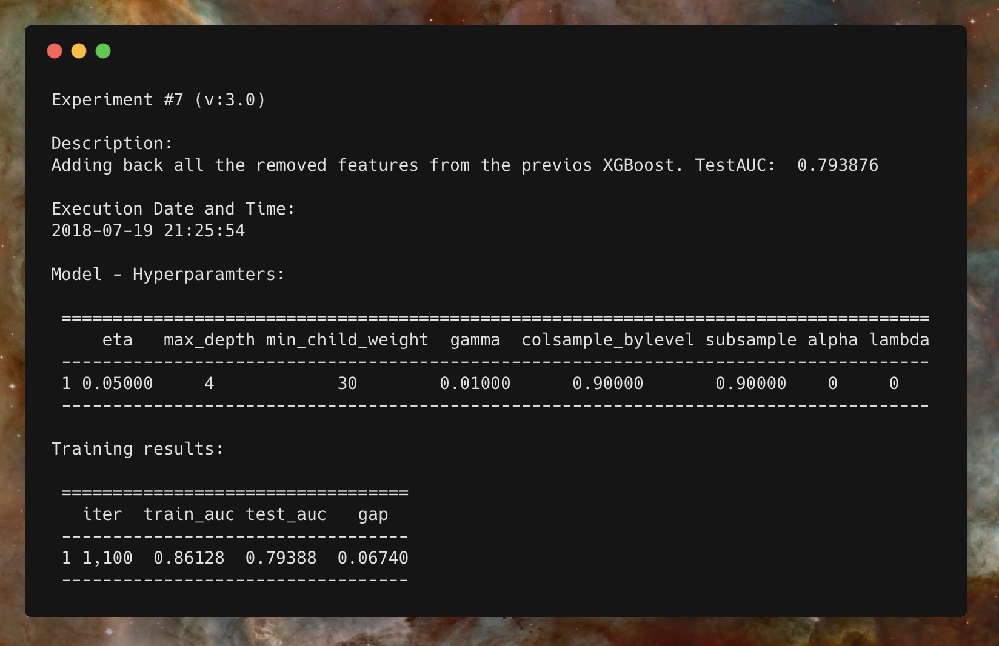

# StarLog

## Overview
R library to entry log records to track the experiments you run, the context and its results. A starlog or log entry was a recording entered into a starship computer record for posterity in Star Trek.



## Installation

``` r
#install.packages("devtools")
devtools::install_github("iuga/starlog")
```
## Usage

``` r
library(starlog)

log_experiment(
    # Entry log information:
    description = "First experiment using XGBoost",
    tag = 'ml', version='1.0', number = 1,
    # Log all the needed information:
    "Final AUC:", 0.789, ""
)
```
